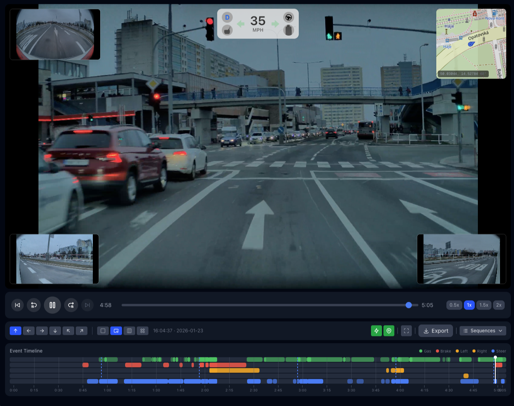

# ExportDash

> Tesla dashcam viewer with seamless playback, live telemetry overlays, and video export.

**[Live Demo → exportdash.cam](https://exportdash.cam)**



**[How it works (full walkthrough) →](https://www.youtube.com/watch?v=6MzdHHmzrME)**

## Features

- **Seamless Playback** — Consecutive 1-minute Tesla clips automatically merged into continuous video
- **Live Telemetry Overlay** — Speed, GPS coordinates, steering angle, and G-forces displayed in real-time
- **All 6 Camera Angles** — Front, rear, left/right repeaters, and pillar cameras with flexible layouts
- **Interactive Map** — Live GPS tracking synced with video playback
- **Event Timeline** — Visual timeline showing brake, gas, turn signals, and steering events
- **Video Export** — Export clips with telemetry burned into the video
- **100% Client-Side** — All processing happens in your browser, no uploads required

## Deploy

[](https://railway.app/new/template?template=https://github.com/nobig-deals/exportdash.cam)
[](https://vercel.com/new/clone?repository-url=https://github.com/nobig-deals/exportdash.cam)
[](https://heroku.com/deploy/?template=https://github.com/nobig-deals/exportdash.cam)

## Quick Start

```bash
# Clone the repo
git clone https://github.com/nobig-deals/exportdash.cam.git
cd exportdash.cam

# Install dependencies
npm install

# Start dev server
npm run dev
```

Open [http://localhost:3000](http://localhost:3000) and drop your TeslaCam folder.

### Docker

```bash
# Build image
docker build -t exportdash .

# Run container
docker run -p 8080:80 exportdash
```

Open [http://localhost:8080](http://localhost:8080)

### Docker Compose

```bash
docker compose up
```

Open [http://localhost:8080](http://localhost:8080)

## How It Works

Tesla dashcam videos contain embedded SEI (Supplemental Enhancement Information) metadata with telemetry data:

- Vehicle speed
- GPS coordinates & heading
- Steering wheel angle
- Accelerator & brake pedal state
- Turn signal status
- G-force readings

ExportDash extracts this metadata using [Tesla's official protobuf schema](https://github.com/teslamotors/dashcam) and displays it as an overlay synchronized with video playback.

### Sequence Detection

Tesla records 1-minute clips continuously. ExportDash automatically detects consecutive clips and merges them:

```
Clip 1: 10:30:00 (60s) ─┐
Clip 2: 10:31:00 (60s)  ├─→ Single 5-minute sequence
Clip 3: 10:32:00 (60s)  │
Clip 4: 10:33:00 (60s)  │
Clip 5: 10:34:00 (60s) ─┘

Clip 6: 10:45:00 (60s) ─→ New sequence (12min gap)
```

## Tech Stack

- **Framework:** Next.js 15 with App Router
- **Styling:** Tailwind CSS
- **Video:** Native HTML5 video with WebCodecs for export
- **Maps:** Leaflet with OpenStreetMap
- **Protobuf:** protobufjs for SEI metadata decoding

## Keyboard Shortcuts

| Key | Action |
|-----|--------|
| `Space` | Play / Pause |
| `←` `→` | Seek ±5 seconds |
| `[` `]` | Previous / Next clip |
| `1` `2` `3` `4` | Layout: Single / PiP / Triple / All |
| `T` | Toggle telemetry overlay |
| `M` | Toggle map |
| `D` | Toggle date/time overlay |
| `E` | Toggle edit mode (trim) |
| `U` | Toggle mph / km/h |
| `F` | Fullscreen |

## Project Structure

```
src/
├── app/
│   └── page.tsx          # Main app component
├── components/
│   ├── VideoPlayer.tsx   # Multi-camera player with controls
│   ├── TelemetryCard.tsx # Speed/telemetry overlay
│   ├── TelemetryTimeline.tsx # Event timeline visualization
│   ├── MapView.tsx       # GPS map overlay
│   ├── VideoExporter.tsx # WebCodecs-based export
│   ├── DropZone.tsx      # File/folder drop handling
│   └── LoadingScreen.tsx # Processing progress UI
├── hooks/
│   └── useSeiData.ts     # SEI extraction & time sync
├── lib/
│   ├── dashcam-mp4.ts    # MP4 parsing & SEI extraction
│   └── sequence-detector.ts # Clip merging logic
└── types/
    └── video.ts          # TypeScript definitions
```

## Credits

- [Tesla Dashcam](https://github.com/teslamotors/dashcam) — Official SEI metadata protobuf schema
- [ViewDash.cam](https://viewdash.cam/) ([source](https://github.com/pixeye33/viewdashcam)) — Original inspiration

## License

MIT
